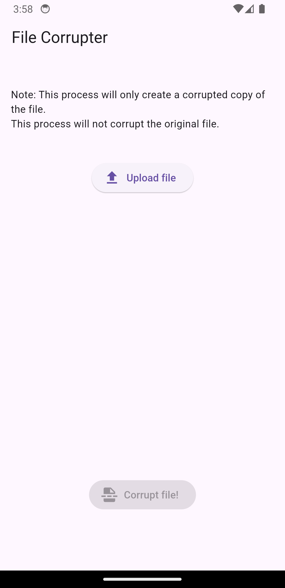
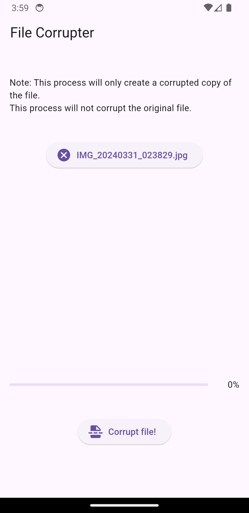
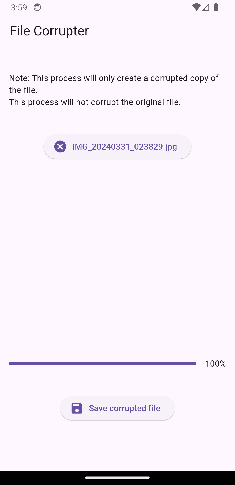

# File Corrupter Mobile App

## Description
This Flutter mobile application allows users to corrupt files, creating altered versions that can be used for pranks or as a humorous solution for extending deadlines on projects.

## Features
- Corrupts files to create modified versions
- User-friendly interface
- Easy to use

## Screenshots

*Upload your file*
\
\
\

*Corrupt your file*
\
\
\

*Save corrupted file*

## Demo video
https://www.youtube.com/watch?v=96MtrtkdSoE

## Installation
1. Clone the repository: `git clone https://github.com/ravanalaskarov/file_corrupter.git`
2. Navigate to the project directory: `cd file_corrupter`
3. Install dependencies: `flutter pub get`
4. Run the app: `flutter run`

## Usage
1. Open the app on your device.
2. Choose the file you want to corrupt.
3. Tap on the "Corrupt" button to create the corrupted version.
4. Share or use the corrupted file for pranks or extending deadlines.

## Contributing
Contributions are welcome! Feel free to fork the repository and submit pull requests with your changes.

## License
This project is licensed under the [MIT License](LICENSE).

## Acknowledgements
- This project was created as a final project for CS50.
- Special thanks to the CS50 team for their guidance and support.

## Disclaimer
This application is intended for entertainment purposes only. The creators do not endorse or encourage the use of the corrupted files for dishonest or unethical purposes.

